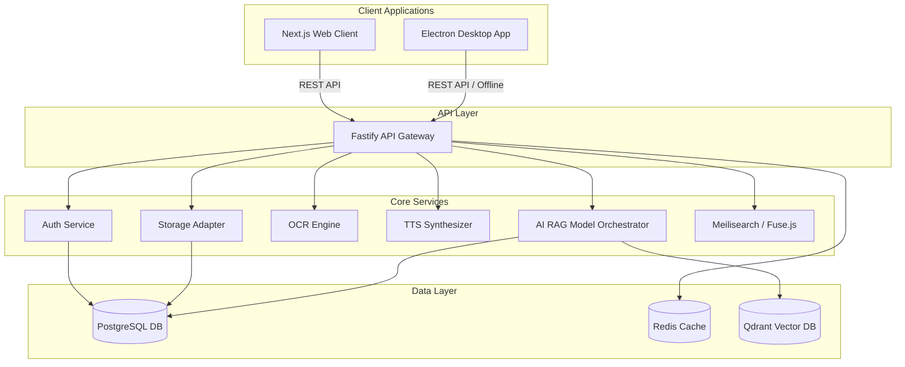
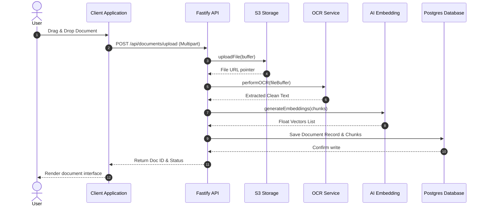
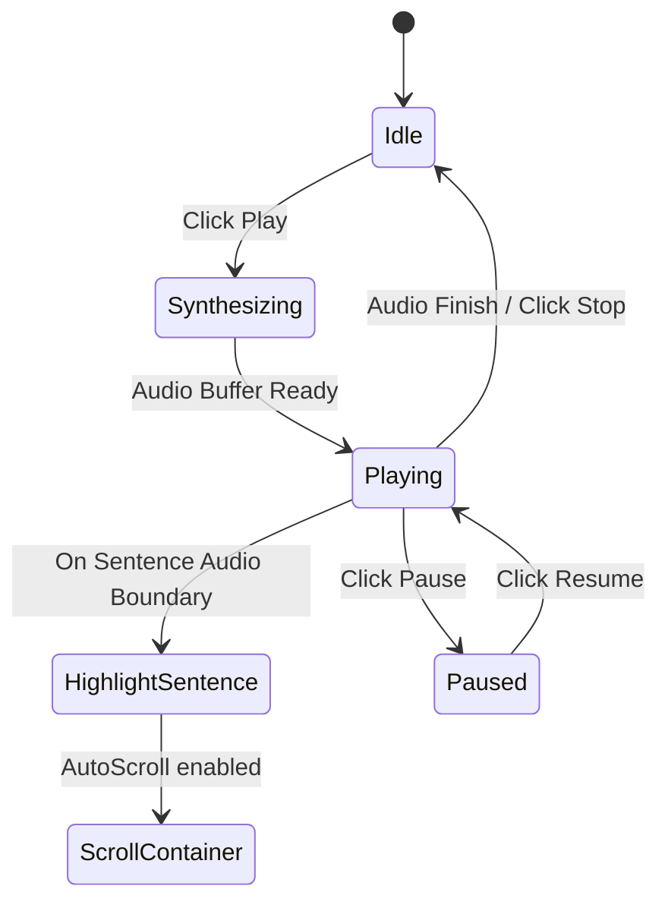

# EchoReader AI System Architecture

This document describes the architectural layout, components, and data sequences of EchoReader AI.

---

## 1. System Component Layout

---

## 2. Document Processing Sequence Diagram

---

## 3. Speech Playback Event Flow

